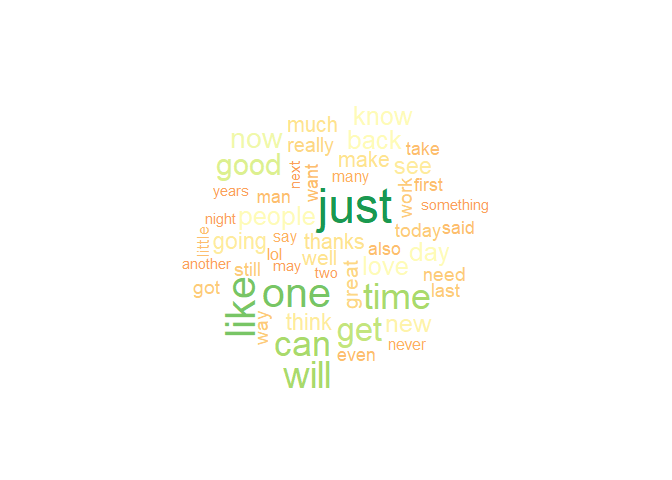
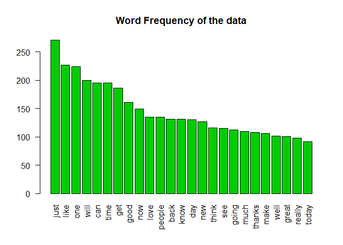
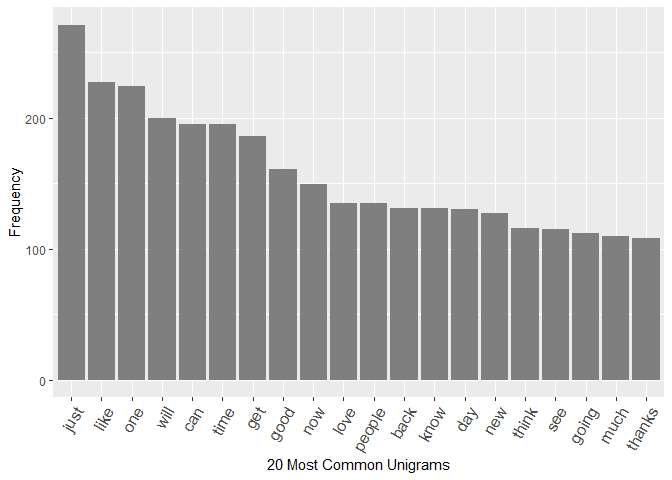
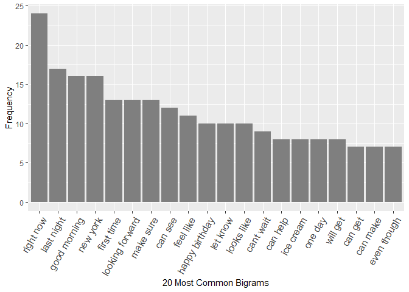
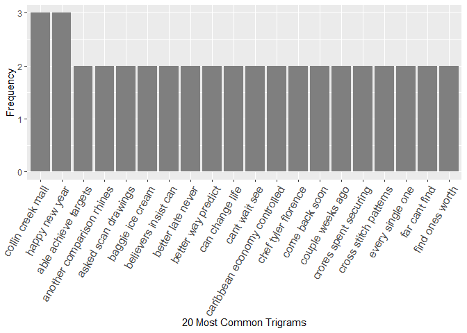

## Synopsis
### This is a milestone report for Week 2 of the capstone project for the cycle of courses Data Science Specialization offered on Coursera by Johns Hopkins University.
### In this report we will provide initial analysis of the data, as well as discuss approach to building the application.


## Librarys

```r
library(RWeka)
library(dplyr)
```

```
## 
## Attaching package: 'dplyr'
```

```
## The following objects are masked from 'package:stats':
## 
##     filter, lag
```

```
## The following objects are masked from 'package:base':
## 
##     intersect, setdiff, setequal, union
```

```r
library(stringi)
library(tm)
```

```
## Loading required package: NLP
```

```r
library(NLP)
library(slam)
library(ggplot2)
```

```
## 
## Attaching package: 'ggplot2'
```

```
## The following object is masked from 'package:NLP':
## 
##     annotate
```

```r
library(wordcloud)
```

```
## Loading required package: RColorBrewer
```

```r
library(RColorBrewer)
```

## Read data set working directory local and obtain data

```r
blogs <- readLines("en_US.blogs.txt", encoding = "UTF-8", skipNul = TRUE)
news <- readLines("en_US.news.txt", encoding = "UTF-8", skipNul = TRUE)
```

```
## Warning in readLines("en_US.news.txt", encoding = "UTF-8", skipNul = TRUE):
## incomplete final line found on 'en_US.news.txt'
```

```r
twitter <- readLines("en_US.twitter.txt", encoding = "UTF-8", skipNul = TRUE)
```
### Basic statistics of words by lines, characters 

```r
WPL=sapply(list(blogs,news,twitter),function(x) 
  summary(stri_count_words(x))[c('Min.','Mean','Max.')])
rownames(WPL)=c('WPL_Min','WPL_Mean','WPL_Max')
stats=data.frame(
  Dataset=c("blogs","news","twitter"),      
  t(rbind(
    sapply(list(blogs,news,twitter),stri_stats_general)[c('Lines','Chars'),],
    Words=sapply(list(blogs,news,twitter),stri_stats_latex)['Words',],
    WPL)
  ))
head(stats)
```

```
##   Dataset   Lines     Chars    Words WPL_Min WPL_Mean WPL_Max
## 1   blogs  899288 206824382 37570839       0 41.75109    6726
## 2    news   77259  15639408  2651432       1 34.61779    1123
## 3 twitter 2360148 162096241 30451170       1 12.75065      47
```
### now we will debug the information and take a sample of it, because as we will see later we will have problems with the size of the records, tables or files that we handle. in addition to taking into account the speed of our process. 

```r
blogs <- iconv(blogs, "latin1", "ASCII", sub="")
news <- iconv(news, "latin1", "ASCII", sub="")
twitter <- iconv(twitter, "latin1", "ASCII", sub="")
# Sample the data
set.seed(479)
data.sample <- c(sample(blogs, length(blogs) * 0.001),
                 sample(news, length(news) *  0.001),
                 sample(twitter, length(twitter) *  0.001))

# Create corpus and clean the data
corpus <- VCorpus(VectorSource(data.sample))
toSpace <- content_transformer(function(x, pattern) gsub(pattern, " ", x))
corpus <- tm_map(corpus, toSpace, "(f|ht)tp(s?)://(.*)[.][a-z]+")
corpus <- tm_map(corpus, toSpace, "@[^\\s]+")
corpus <- tm_map(corpus, tolower)
corpus <- tm_map(corpus, removeWords, stopwords("en"))
corpus <- tm_map(corpus, removePunctuation)
corpus <- tm_map(corpus, removeNumbers)
corpus <- tm_map(corpus, stripWhitespace)
corpus <- tm_map(corpus, PlainTextDocument)
```
## Wordcloud
#### now let's see the Wordcloud function to see what words are the ones we see in the sample 

```r
wordcloud(corpus, max.words=50,random.order=TRUE,rot.per=.15,colors=
            colorRampPalette(brewer.pal(9,"RdYlGn"))(32), scale=c(3, .3))
```

<!-- -->

#### Now plotting the frequncies of the words that are used in news, twitter and the blogs.


```r
gc()
```

```
##            used  (Mb) gc trigger  (Mb) max used  (Mb)
## Ncells  4364257 233.1    7490862 400.1  7490862 400.1
## Vcells 62678098 478.2   93282826 711.7 77668856 592.6
```

```r
corpus_tdm <- TermDocumentMatrix(corpus)
corpus_tdm_m <- as.matrix(corpus_tdm)
corpus_tdm_m_freq <- rowSums(corpus_tdm_m)
corpus_tdm_m_freq<-sort(corpus_tdm_m_freq, decreasing = TRUE)
barplot(corpus_tdm_m_freq[1:25], col = "green3", las = 2,
        main = "Word Frequency of the data")
```

<!-- -->

```r
gc()
```

```
##            used  (Mb) gc trigger   (Mb)  max used   (Mb)
## Ncells  4377465 233.8    7490862  400.1   7490862  400.1
## Vcells 99884338 762.1  166409121 1269.7 137153970 1046.5
```

```r
getSample <- function(tdm) {
  freq <- sort(rowSums(as.matrix(tdm)), decreasing = TRUE)
  return(data.frame(word = names(freq), freq = freq))
}

bigram <- function(x) NGramTokenizer(x, Weka_control(min = 2, max = 2))
trigram <- function(x) NGramTokenizer(x, Weka_control(min = 3, max = 3))
makePlot <- function(data, label) {
  ggplot(data[1:20,], aes(reorder(word, -freq), freq)) +
    labs(x = label, y = "Frequency") +
    theme(axis.text.x = element_text(angle = 60, size = 12, hjust = 1)) +
    geom_bar(stat = "identity", fill = I("grey50"))
}
# Get frequencies of most common n-grams in data sample
freq1 <- getSample(removeSparseTerms(TermDocumentMatrix(corpus), 0.9999))
freq2 <- getSample(removeSparseTerms(
  TermDocumentMatrix(corpus, control = list(tokenize = bigram)), 0.9999))
freq3 <- getSample(removeSparseTerms(
  TermDocumentMatrix(corpus, control = list(tokenize = trigram)), 0.9999))
```
### Below we see the possible combinations of tokens that can help us suggest 
### or predict which word could follow 


```r
makePlot(freq1, "20 Most Common Unigrams")
```

<!-- -->

```r
makePlot(freq2, "20 Most Common Bigrams")
```

<!-- -->

```r
makePlot(freq3, "20 Most Common Trigrams")
```

<!-- -->

## Conclusions
### From this small summary we see that we have to purify the information, in addition there is the problem of the size of the files that we can use in memory, so we must take into account the physical properties of the equipment and the time it takes us to process it, in addition to seeing duples of words that allow us to estimate which word we could suggest. 
